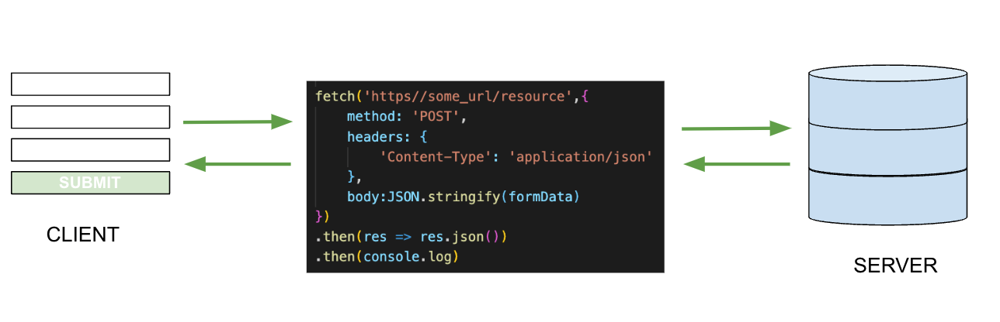

# Post Requests
## SWBAT
- [ ] Observe how to send a  POST request using HTML forms and JavaScript
- [ ] Observe how to send a PATCH request using HTML forms and JavaScript
- [ ] Observe how to send a DELETE request using HTML buttons and JavaScript
- [ ] Explain the difference between optimistic and pessimistic rendering

## Deliverables 
- Inside of handleForm make a POST request to ‘/books’
    - Explore the MDN documentation on POST 
    - Review the request object and what each property represents. 
    - Review JSON.stringify and why it's used on the body of our request
    - Handle the promise using a .then
    - Pass the .then a callback that calls .json on the response
    - Handle the promise using a second .then 
    - Render data to the DOM 
    - Discuss optimistic vs pessimistic rendering
    - Add a .catch to handle failed promises 

- Demo: Delete
    - In renderBookCard, within the callback passed to the eventListener on the delete button, create a DELETE request.
    - Update the DOM pessimistically 
- Demo Update:
    - In renderBookCard create an input. 
    - Set its value to the books inventory. 
    - Assigned its type to number.
    - Append the input to the li
    - Add an eventListener to the input.
    - Pass the event listener a callback that performs a PATCH request.
    - Review the differences between a PUT and PATCH

- Refactor 
    - Move the post functionality to a function called createResource. The function should have a URL and body as its parameters.
    - Return the POST request.
    - Call createResource in handleForm, passing it the URL for ‘/books’ and the book Object.
    - Remove the second .then and .catch from the POST and chain it to the invocation of createResource
    - Put the DELETE request into a separate function
    - Put the PATCH request into a separate function
- Bonus
    - Create a store form in index.html
    - Add a submit eventListener to form
    - Add a new form handler that builds store
    - Call POST request to add store

## POST (Create)


Posts send data to the server. The information is usually sent from a FORM, creating a resource in the database. A POST is typically for creating new data instead of updating data, like PUT or PATCH.

A POST requires an additional argument, a request/config object.

```
// Method: The HTTP method used in this request. Fetch requests are GET by default. Though they can take a request object, it's not necessary. Other requests, such as POST, require the method to identify what type of request it is. 

// Headers: An object that contains additional information for the request. The Content-Type indicates the original media type of the data. 

// Body: The data from the request. Before the request can be sent the data must be converted to JSON.
fetch(url, {
    method: 'POST',
    headers: {
        'Content-Type': 'application/json'
    },
    body:JSON.stringify(formData)
})
```

## Patch (Update)
Patch updates/modifies a resource.

```

// The url in a patch requires an id to identify the resource being updated. 
// The HTTP method is 'PATCH'
// The body can take the full resource or one property of the resource.

fetch(url/:id, {
    method: 'PATCH',
    headers: {
        'Content-Type': 'application/json'
    },
    body:JSON.stringify({prop:value})
})
```

## Delete (Destroy)
Delete removes a resource from the server. Unlike Post and Patch it doesn't require headers or a body, though some backend frameworks may require a header.

```
// Delete does require the method and the id of the resource being deleted.
fetch(url/:id, {
    method: 'DELETE',
})

```