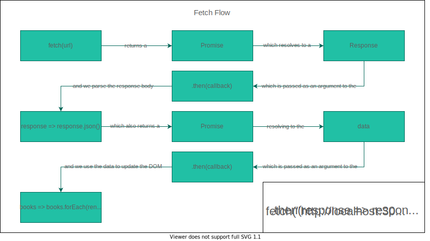
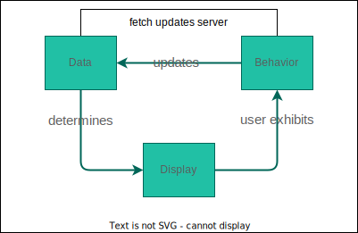
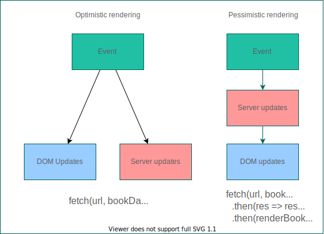

# POST Requests

---

### Lecture Goals

- Observe how to send a POST request using HTML forms and JavaScript
- Explain the difference between optimistic and pessimistic rendering

---

---

---

---

## Fetch Configuration

<pre><code data-line-numbers="2,6,7,12">fetch(url, {
  method: 'POST', // *GET, POST, PUT, DELETE, etc.
  mode: 'cors', // no-cors, *cors, same-origin
  cache: 'no-cache', // *default, no-cache, reload, force-cache, only-if-cached
  credentials: 'same-origin', // include, *same-origin, omit
  headers: {
    'Content-Type': 'application/json'
    // 'Content-Type': 'application/x-www-form-urlencoded',
  },
  redirect: 'follow', // manual, *follow, error
  referrerPolicy: 'no-referrer', // no-referrer, *no-referrer-when-downgrade, origin, origin-when-cross-origin, same-origin, strict-origin, strict-origin-when-cross-origin, unsafe-url
  body: JSON.stringify(data) // body data type must match "Content-Type" header
});</code></pre>

[MDN's article on using the Fetch API](https://developer.mozilla.org/en-US/docs/Web/API/Fetch_API/Using_Fetch#supplying_request_options)

---

---

## Working with JSON

- Fetch to URL returns Promise for a response
- response.json() returns a Promise for the parsed body
- Fetch returns a resolved response even when we get an error from the API server. 

This happens consistently as we send fetch requests, so we'll end up typing a lot of boilerplate each time–especially when we want to add a catch to our fetch call. {.fragment}

---

## Putting boilerplate into functions

<pre><code data-line-numbers>function getJSON(url) {
  return fetch(url)
    .then(response => {
      if (response.ok) {
        return response.json()
      } else {
        throw (response.statusText)
      }
    })
}

function postJSON(url, data) {
  return fetch(url, {
    method: "POST",
    headers: {
      "Content-Type": "application/json"
    },
    body: JSON.stringify(data)
  })
    .then(response => {
      if (response.ok) {
        return response.json()
      } else {
        throw (response.statusText)
      }
    })
}</code></pre>