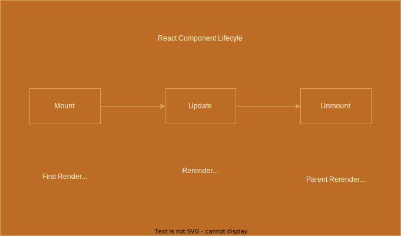

# State & Events

---

<h2><strong> ✅ Objectives </strong></h2>

- Explain the importance of state
- Explain the difference between state and props
- Observe how to use the useState hook
- Observe how to use DOM events in React

---

<h3 style="text-align: center;"><strong>Why is state important?</strong></h3>
<div style="font-size: 0.7em">
🏹 State is used to track information that changes over time. 

🏹 Props are passed from the parent component, state is internal to a component. 

🏹 Values stored in state are meant to change, especially in response to user behaviors (as the user interacts with the DOM and triggers events).

🏹 We can do conditional rendering based on state values. This is a key component of declarative programming in React: we tie our components to our state by integrating state values into our JSX rendering logic. This way, changes in state eventually cause changes to the DOM (Updating the Dark Mode button!).
</div>


---

##### React Flow


<div style="font-size: 0.8em">
🔑 We use state to store data that may change in response to user behavior

🏹 To work with state in a functional component, we use the `useState` hook
</div>

---

###### Local Variables vs State Variables

<iframe src="https://codesandbox.io/embed/counter-state-example-0r8stb?fontsize=14&hidenavigation=1&theme=dark"
  style="width:100%; height:600px; border:0; border-radius: 4px; overflow:hidden;"
  title="counter-state-example"
  allow="accelerometer; ambient-light-sensor; camera; encrypted-media; geolocation; gyroscope; hid; microphone; midi; payment; usb; vr; xr-spatial-tracking"
  sandbox="allow-forms allow-modals allow-popups allow-presentation allow-same-origin allow-scripts"
></iframe>


---

#### Handling events in React 

Event handlers can only be attached to DOM elements, we can't attach event listeners directly to our components

<div style="display: flex; flex-direction: row; font-size: 0.95em;">
  <div style="width: 50%">
    
#### Doesn't work:

```js
function Button() {
  return (
    <button>
      Click Me
    </button>
  );
};

<Button onClick={() => console.log('clicked!')}>
  Click Me
</Button>
```
    
    
  </div>
  <div style="width: 50%">

#### Does work

```js
function Button({ onClick }) {
  return (
    <button onClick={onClick}>
      Click Me
    </button>
  );
};

<Button onClick={() => console.log('clicked!')}>
  Click Me
</Button>
```

  </div>
</div>


---

#### Defining Event Handlers

We can also define event handler functions within our components and pass the function reference to our event listener in the JSX.

```js
function Counter() {
  const [count, setCount] = useState(2);
  const handleDecrement = (event) => {
    if(count > 0) {
      setCount(count => count - 1);
    }
  }

  return (
    <div>
      {count}
      <button onClick={handleDecrement}>-</button>
    </div>
  );
};
```

This is helpful in the case where we need to introduce additional event handling logic. We can do so without cluttering our JSX.

---

#### ✅ Toggle Dark Mode Button

<div style="font-size: 0.9em">

Inside the `Header` component, there is a button with textContent of `Light Mode`

```js
<button>Light Mode</button>
```

Attach an `onClick` event to the button:

```js
<button onClick={() => console.log("clicked")}>Light Mode</button>
```

We can also also refactor using a helper function:

```js
const handleClick = () => console.log('clicked')

<button onClick={handeClick}>Light Mode</button>
```

💡 We need to now figure out how to properly set new text for the button and perform DOM manipulation to reflect the change. That is where `state` will come in.

</div>

---

#### Passing State as Props

<iframe src="https://codesandbox.io/embed/vigilant-minsky-iiykrb?fontsize=14&hidenavigation=1&theme=dark"
  style="width:100%; height:600px; border:0; border-radius: 4px; overflow:hidden;"
  title="vigilant-minsky-iiykrb"
  allow="accelerometer; ambient-light-sensor; camera; encrypted-media; geolocation; gyroscope; hid; microphone; midi; payment; usb; vr; xr-spatial-tracking"
  sandbox="allow-forms allow-modals allow-popups allow-presentation allow-same-origin allow-scripts"
></iframe>

---



---


---

## ☕️ Break!!! ☕️

---

#### Filter by project name in ProjectList component 

<div style="font-size: 0.9em">

Currently, we are creating a `ProjectCard` component for each project inside of the `projects` array:

```js
const renderedProjects = projects.map(project => {
  return <ProjectCard key={project.id} project={project} />
})
```

We need to make this dynamic by implementing a filter feature that returns the projects based on the user's entry in the `search input`

```js
<input type="text" placeholder="Search..." />
```

</div>


---

#### Filter by project name in ProjectList component steps: 

<div style="font-size: 0.9em">

1. Initialize state to track the `searchQuery`:

```js
const [searchQuery, setSearchQuery] = useState("");
```

2. Add on `onChange` event to the input element:

```js
<input onChange={handleSearch} type="text" placeholder="Search..." />
```

3. Update the state in the `handleSearch` helper function:

```js
const handleSearch = (e) => setSearchQuery(e.target.value);
```

</div>


---

#### Filter by project name in ProjectList component steps contd:

<div style="font-size: 0.9em">

4. Filter the `projects` array to return the search results based on the `searchQuery` value:

```js
const searchResults = projects.filter((project) =>
  project.name.toLowerCase().includes(searchQuery.toLowerCase())
);
```

5. Map over `searchResults` instead of `projects` when creating `renderedProjects`:

```js
const renderedProjects = searchResults.map(project => {
  return <ProjectCard key={project.id} project={project} />
})
```

**Note:** If the searchQuery is an empty string, the `filter()` will return all the project items

</div>


---

### 💡 Conclusion 

<div style="font-size: 0.9em">

Events and state are both important and can work together to allow the DOM to reflect a users interactions and activities by:

1. Attaching events to parts of our JSX

2. Updating the state based on the goal of the event

3. State change forces a re-render that will cause DOM manipulation and reflect the changes on the interface

<h4 style="text-align: center;"><strong> user behavior -> update state -> React updates DOM </strong></h4>

</div>