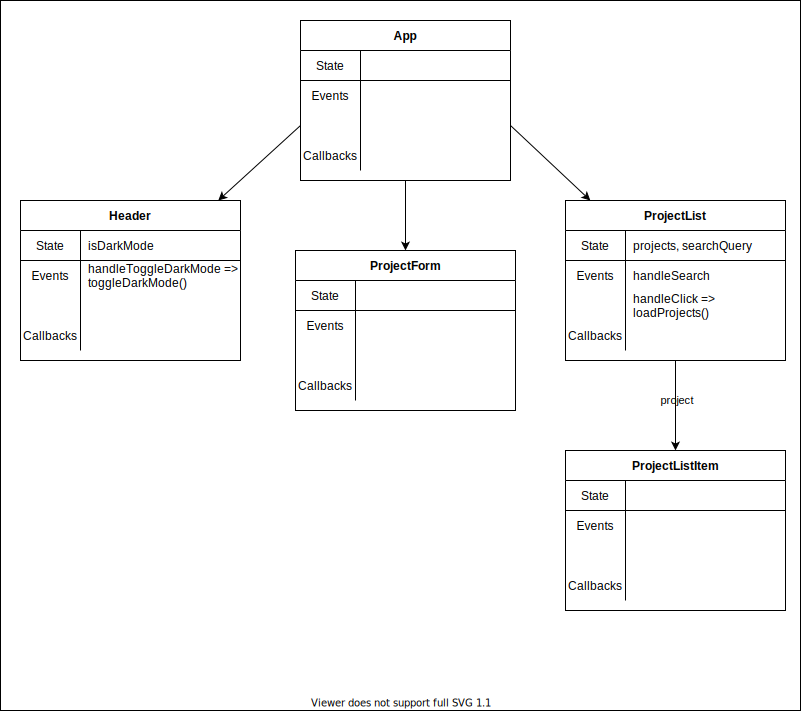

## React Information Flow 


https://labs.tadigital.com/index.php/2020/03/31/unidirectional-data-flow-in-react/

---

### ✅ Objectives 

- Define the term “lifting state”
- Recognize the pattern for changing state in a parent component from a child component
- Explain the role that callback functions play in changing parent state
- Observe how we can render reusable components that invoke different callback functions after an event
- Recognize destructured props and how to work with them

---

### Lifting State Up ⬆️ 

"In React, sharing state is accomplished by moving it up to the closest common ancestor of the components that need it. This is called <strong>“lifting state up”.</strong>"

https://reactjs.org/docs/lifting-state-up.html

---

#### 🤔 Decisions - Where should state be? 

<div style="font-size: 0.8em">

From [Step 4 of Thinking in React](https://reactwithhooks.netlify.app/docs/thinking-in-react.html#step-4-identify-where-your-state-should-live): To decide where state should live, for each piece of state in your application:


- Identify every component that renders something based on that state.
- Find a **common owner component** (a single component above all the components that need the state in the hierarchy). {.fragment}
- Either the common owner or another component higher up in the hierarchy should own the state. {.fragment}
- If you can’t find a component where it makes sense to own the state, create a new component solely for holding the state and add it somewhere in the hierarchy above the common owner component. {.fragment}

</div>


---

### Current Data Flow 

<div style="display: flex;">
<div style="width: 60%">
<center></center>
</div>
<div style="width: 40%; font-size: 0.6em; text-align: left; display: flex; flex-direction: column; justify-content: center;">

💡 Question 1: Do you see a problem with storing `isDarkMode` in state within the `Header` component?

💡 Question 2: How about storing `projects` in state within the `ProjectList` component? {.fragment}

💡 Question 3: How about storing `searchQuery` in state within the `ProjectList` component? {.fragment}

</div>
</div>


---

### Updated Data Flow

<center></center>

---

#### First Task: Lifting the darkMode state up 🔧 

<div style="font-size: 0.8em">

- Currently, we have our isDarkMode state within the Header component.

- What's the problem with that? 


- If we want to update the style of the entire application as it changes, we will only cause a re-render to `Header` component and its children. We won't be able to switch the entire app into dark mode {.fragment} 


</div>

---

<iframe src="https://codesandbox.io/embed/inverse-data-flow-diagram-mtvrs6?fontsize=14&hidenavigation=1&theme=dark&view=preview"
  style="width:100%; height:880px; border:0; border-radius: 4px; overflow:hidden;"
  title="inverse-data-flow-diagram"
  allow="accelerometer; ambient-light-sensor; camera; encrypted-media; geolocation; gyroscope; hid; microphone; midi; payment; usb; vr; xr-spatial-tracking"
  sandbox="allow-forms allow-modals allow-popups allow-presentation allow-same-origin allow-scripts"
></iframe>

<a href="https://mtvrs6.csb.app/" target="_blank" rel="noreferrer">🔖 Feel free to bookmark this!</a>

---

#### Let's fix it! 😸 

<div style="font-size: 0.8em">

1. Lift the `isDarkMode` state to the `App` component. 

2. Create a function `onToggleDarkMode` that will handle updating the value of `isDarkMode` when necessary {.fragment}

3. Pass `isDarkMode` down as a prop to the `Header` component to use as the condition for what text the button will render {.fragment}

4. Pass `onToggleDarkMode` to be used as a callback function when the button is clicked {.fragment}

❓ Why? This allows us to maintain the state and manage its value where the state is defined {.fragment}

</div>

---

#### Diagram 

<center></center>

---

#### Recap 


<small>First, move the `isDarkMode` to the `App` component:</small>

```js
function App() {
  const [isDarkMode, setIsDarkMode] = useState(true);

...
```

<small>Second, create the `onToggleDarkMode` function that will update the `isDarkMode` state:</small>

```js
const onToggleDarkMode = () => setIsDarkMode(isDarkMode => !isDarkMode);
```

<small>Third, pass both `isDarkMode` and `onToggleDarkMode` to `Header` as props</small>

```jsx
<Header isDarkMode={isDarkMode} onToggleDarkMode={onToggleDarkMode} />
```


---

#### Inside the Header component: 

<small>Destructure the props in the argument and use the variables to render the button text and invoke the callback within your `onClick` event handler:</small> 

```js
function Header({ isDarkMode, onToggleDarkMode }) {
  const handleToggleDarkMode = (e) => {
    onToggleDarkMode();
  }
  
  const buttonText = isDarkMode ? "Light Mode" : "Dark Mode"

  return (
    <header>
      <h1>
        <span className="logo">{"//"}</span>
        Project Showcase
      </h1>
      <button onClick={handleToggleDarkMode}>{buttonText}</button>
    </header>
  );
};

export default Header;
```

---

### What about projects?

<iframe src="https://codesandbox.io/embed/inverse-data-flow-diagram-mtvrs6?fontsize=14&hidenavigation=1&theme=dark&view=preview"
  style="width:100%; height:880px; border:0; border-radius: 4px; overflow:hidden;"
  title="inverse-data-flow-diagram"
  allow="accelerometer; ambient-light-sensor; camera; encrypted-media; geolocation; gyroscope; hid; microphone; midi; payment; usb; vr; xr-spatial-tracking"
  sandbox="allow-forms allow-modals allow-popups allow-presentation allow-same-origin allow-scripts"
></iframe>

---


#### Lifting Projects in State

<small>We need to modify `projects` from `ProjectForm` as well as access it from `ProjectList` so it needs to live in a common parent, in this case, we'll move it to our new `ProjectsContainer` component:</small>

```js
// this needs to move up
const [projects, setProjects] = useState([]);
// as does the function that updates this piece of state
const loadProjects = () => {
  fetch("http://localhost:4000/projects")
    .then((res) => res.json())
    .then((projects) => setProjects(projects));
}
```

---

#### Passing down the props

<small>After lifting state up, we need to pass it down as props to the component where it lived before!</small>

```js
// src/components/ProjectsContainer.js
<ProjectList projects={projects} onLoadProjects={onLoadProjects} />

// src/components/ProjectList.js
const ProjectList = ({ projects, onLoadProjects }) => { 
```
<small>

Notice we're renaming `loadProjects` to `onLoadProjects` to indicate that it is a callback function that will be associated with an event handler in a child component. 

Naming convention => `onBehaviorName`

</small>

---

#### 💡 Conclusion 

<iframe src="https://codesandbox.io/embed/inverse-data-flow-diagram-mtvrs6?fontsize=14&hidenavigation=1&theme=dark&view=preview"
  style="width:100%; height:650px; border:0; border-radius: 4px; overflow:hidden;"
  title="inverse-data-flow-diagram"
  allow="accelerometer; ambient-light-sensor; camera; encrypted-media; geolocation; gyroscope; hid; microphone; midi; payment; usb; vr; xr-spatial-tracking"
  sandbox="allow-forms allow-modals allow-popups allow-presentation allow-same-origin allow-scripts"
></iframe>