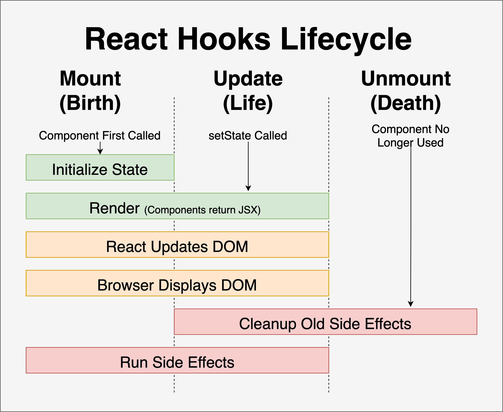
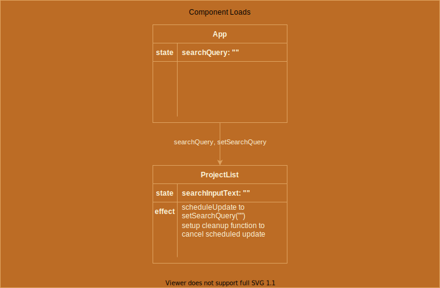
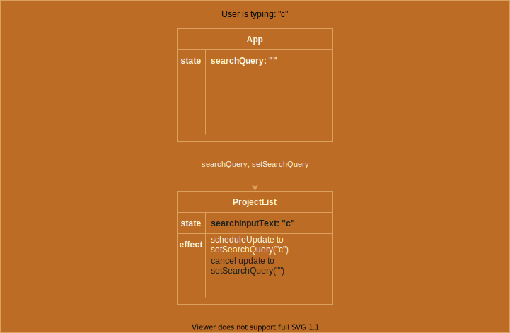
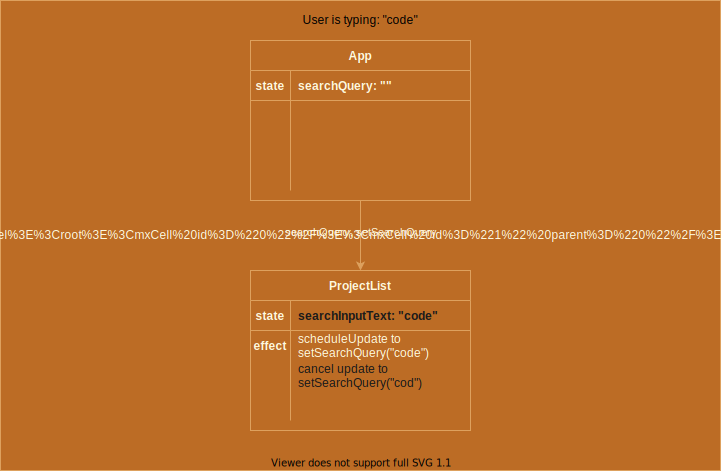
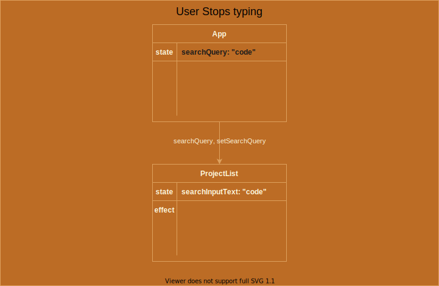
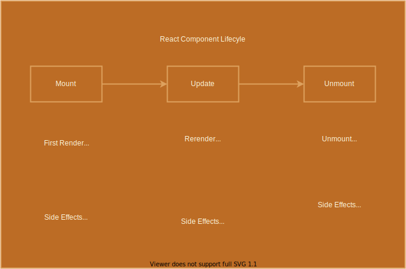

## Side Effects and Data Fetching 💻 

---

## ✅ Objectives 

- Observe how to send a POST request via form
- Explain what a side effect is
- Observe how React manages side effects with the useEffect hook
- Observe how to use the useEffect hook to fetch data on page load
- Review changing parent state

---

#### Project Showcase Features
<div style="font-size: 0.8em">

- Persist projects to database upon submitting the ProjectForm
- Load all projects from db on component load
- Load all phase 4 projects from db when users click on the phase 4 button
- Load all matching projects from db by phase and value in the search input
- Bonus: Add debouncing to search input so our search input only triggers a single fetch request when we type (rather than sending one for each keystroke)
</div>

---

### Warmup
<small>

Let's head over to `src/components/ProjectForm.js` and add in persistence.

</small>

#### Getting Started:

<small>

- `cd 05_side_effects_and_data_fetching/project_showcase`
- `npm run server`
- in another terminal: `npm install` then `npm start`

We want to be able to submit the form to create a new project, see the project appear in the DOM, reload the page and see it still appearing on the page!
</small>

---

### What to know before discussing side effects? 

<small>The React components we've seen so far are 'pure functions'. This means that given an input(such as a props and state), the return is 100% predictable.</small>

```js
function Greeting({ name }) {
  return <h1>Hello, {name}</h1>;
};

export default Greeting;
```

<small>Any time Greeting is called, and provided a new prop, we will always be able to predict the output, regardless of the prop value</small>

---

### What is a side effect? 

<small>
<p class="fragment">"We perform a side effect when we need to reach outside of our React components to do something. Performing a side effect, however, will not give us a predictable result."<br/>
https://www.freecodecamp.org/news/react-useeffect-absolute-beginners/</p>

The term 'side effect' not only applies to React but to all functional programming. {.fragment}

“A side effect is anything that affects something outside the scope of the function being executed ” - Michael W. Brady {.fragment}

💡 These are operations that will still have an effect on our component, but won't happen during the rendering process (they'll happen after) {.fragment}

</small>

---



---

### Examples of side effects

- Fetching Data from a server {.fragment}

- Interacting with a browser API like the `document` or `window` {.fragment}
  - Utilizing interval timers such as `setInterval` or `setTimeout` {.fragment}
  - adding a `mousemove` event listener to the `window` object {.fragment}

---

### 🛠️ useEffect() hook

<div style="font-size: 0.7em">

- `useEffect()` runs after the first render and then after every subsequent re-render. 


- Takes in two arguments: {.fragment}

  - A callback function defining the logic to be executed as a side effect(the 'effect') {.fragment}

  - A dependency array that defines when the side effect should occur. This argument is optional and does not always need to be provided {.fragment}
  - The dependency array allows us to limit when the effect will run again by specifying the values for props, state, etc. on which this effect depends {.fragment}

- `useEffect()` is essentially telling React that the component needs to do something else AFTER the component has rendered {.fragment}

</div>

---

#### 💡 In a Nutshell 💡

 useEffect synchronizes a side effect with a react component's rendering.

---

### 1️⃣ useEffect() hook without a dependency array 

```js
useEffect(() => {
  // Some effect to occur
});
```
<div style="font-size: 0.8em">

- In this example, only 1 argument is passed to useEffect {.fragment}

- The dependency array is omitted {.fragment}

- This side effect will synchronize with all renders {.fragment}

</div>

---

### 2️⃣ useEffect() hook with an empty dependency array 

```js
useEffect(() => {
  // Some effect to occur
}, []);
```

<div style="font-size: 0.8em">

- In this example, the dependency array is passed as the second argument {.fragment}

- The dependency array is empty with no provided values {.fragment}

- That means that the side effect will only run one time, upon the initial render of the component. It does not synchronize with any props or state. {.fragment}

</div>


---

#### 3️⃣ useEffect() hook with a value provided to the dependency array  

```js
useEffect(() => {
  // Some effect to occur
}, [data]);
```

<div style="font-size: 0.65em">

- In this example, the dependency array is passed a piece of data. This data can be any object or function from elsewhere in our React code that we use within the side effect function. {.fragment}

- That means that the side effect will run once upon the component's initial render and then after any render where one of the dependencies changed. {.fragment}

- We need to: {.fragment}

  - ✅ make sure that the projects we fetch from the database align with the phase we have selected by clicking one of the phase button filters {.fragment}
  - ✅ rework the search input so it makes calls to our api when we type in the input rather than filtering through local state in react {.fragment}

</div>


---

### Cleaning up 🧹 

<div style="font-size: 0.7em">


- There will be some code that is necessary to clean up after the component is no longer being mounted on the DOM. AKA turning off our side effects

- Why? To avoid 'memory leaks' which means using memory for data that is no longer necessary {.fragment}

- Examples: Timeouts, subscriptions, event listeners added to the window {.fragment}

- How? Return a cleanup function from the useEffect callback! {.fragment}

</div>

---

### Cleanup example 


```js
function Timer() {
  const [count, setCount] = useState(0);

  useEffect(() => {
    let timer = setInterval(() => {
      setCount((count) => count + 1);
    }, 1000);

    return () => clearInterval(timer);
  }, []);

  return <h1>I've rendered {count} times!</h1>;
};
```

<a href="https://codesandbox.io/s/useeffect-cleanup-ig17kd?file=/src/Timer.js" target="blank" rel="noreferrer">Codesandbox Example</a>

---

### When does cleanup happen?

<small>

  - During an update, if the side effect function will run again on this re-render, then the cleanup function will run first before the effect happens again.

  - When the component unmounts (is removed from the DOM)

</small>


  

---

<div style="font-size: 0.8em">

  <div style="text-align: left">
  
  **NOTE:** In Development when using React `StrictMode` (which we are):</div>
  - components will be double rendered when they first mount to help you spot errors more easily {.fragment}
  - the component will go through a mount and update right away {.fragment}
  - In the codesandbox demo, I removed Strict Mode so we can more easily understand what's happening with the cleanup. {.fragment}
  - In your own development it may seem like the cleanup function is running right when the component loads. The double render from StrictMode is the reason. {.fragment}
</div>

---

### Debouncing

<div style="font-size: 0.7em">

#### The problem

- Right now a separate fetch request is sent to the server for every character we type into the search input - this causes janky rendering and multiple unnecessary repaints of the ProjectList component

#### The solution
- Debounce the search input! {.fragment}
  - use a separate piece of state to manage the search input {.fragment}
  - when that piece of state changes, schedule a change to the state variable that will trigger the fetch request for 300 milliseconds in the future {.fragment}
  - cancel the previously scheduled update to that state variable {.fragment}

</div>

---



---



---


---


---



---



---

### 💡 Conclusion 

<div style="font-size: 0.8em">

- Side effects run after first render
- Side effects run after every subsequent render where one of the values in their dependency array changes {.fragment}
- Any time a side effect function refers to a value in state or props, that value should be included in its dependency array (follow the eslint hints in your editor) {.fragment}
- If your side effect interacts with an external API or a native browser API like `setInterval` or `setTimeout` make sure to return a cleanup function to avoid memory leaks {.fragment}
- useEffect with an empty dependency array is your go to tool for fetching data when a component first loads {.fragment}

</div>

---

