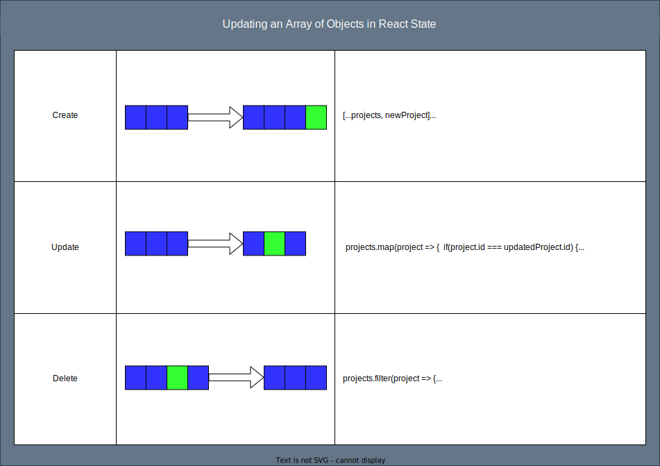

# PATCH & DELETE requests

## SWBATs:

- [ ] Observe how to send a PATCH & DELETE request
- [ ] Review changing parent state

## Deliverables

- Review changes to the project showcase app to prepare for editing
- get our ProjectEditForm working to persist changes to db.json and to local state
- get the delete button working for projects so it removes the project from db.json and local state
- get the clap button working for projects so the number of claps persists to db.json and local state

#### 1. Review changes to the project showcase application

- Observe the `ProjectEditForm` component

- Observe the edit button added to `ProjectCard` component

- Observe the updates applied in the `App` component

- Update the `useEffect` inside the `ProjectEditForm` component so that the side effect will run upon `projectToEdit` updates

#### 2. Submit the edit project form and make a PATCH request

- Inside of the `ProjectEditForm` component, update `handleSubmit` to include a `PATCH` request

- Include the updated state values in the `PATCH` request

- Update the `projects` state in the parent component `App` using the `.map` function

  - The goal is to return a new array with the original project excluded and the newly updated project included

- Reset the edit form after submission is complete

#### 3. Click the delete button and make a DELETE request

- Attach an `onClick` event listener to the delete button

- Add a `DELETE` fetch request to the event handler for the delete button

- Update the `projects` state in the parent component `App` using the `.filter` function

  - The goal is to return a new array with the deleted project excluded

#### 4. Click the claps button and persist the updated number of claps

- Send a `PATCH` request when the `clapsCount` is updated through a click event

- Update the `projects` state in the parent component `App` using the `.map` function

